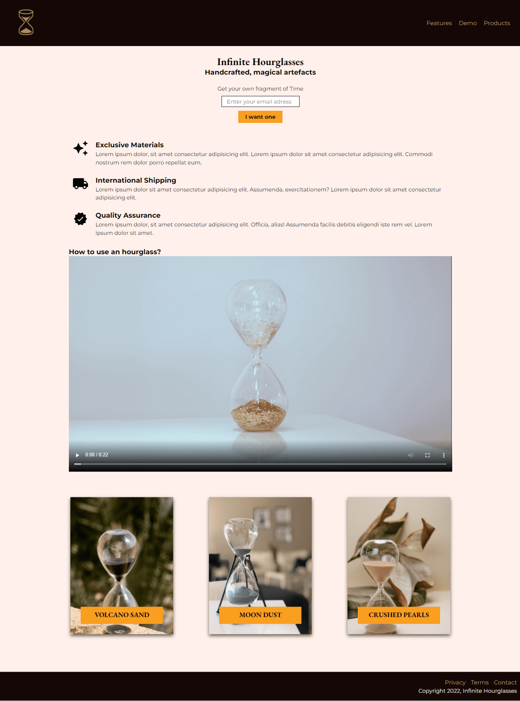

# Infinite Houglasses Landing Page
This is a product landing page for a fictional company called Infinite Houglasses. It was made as the third project for the Responsive Web Design Certification delivered by FreeCodeCamp.

The page is responsive and implemented with ARIA labels.

This project was built with:
- Mobile-first workflow
- Semantic HTML5 markup
- CSS properties
- Flexbox
- Media queries

And tested with:
- The Colour Contrast Analyser (CCA)
- The web accessibility evaluation tool (WAVE)
- The Markup Validation Service of W3C

## Live site

- Live Site URL: [GitHub Page](https://ax-cd.github.io/product-landing-page-fcc-project/)

## Screenshot

## Links

- Frontend Mentor - [@Ax-cd](https://www.frontendmentor.io/profile/Ax-cd)
- Instagram - [@ax.coding](https://www.instagram.com/ax.coding/)

## Resources

- This article was a refresher on how to fixed the menu - ["HOW TO - Fixed Menu" on w3schools.com](https://www.w3schools.com/howto/howto_css_fixed_menu.asp)
- Tutorial I followed to make the product cards - ["CSS Card Hover Effects | Html CSS" by Online Tutorials on YouTube](https://www.youtube.com/watch?v=9pXGz6Dv3q0)
